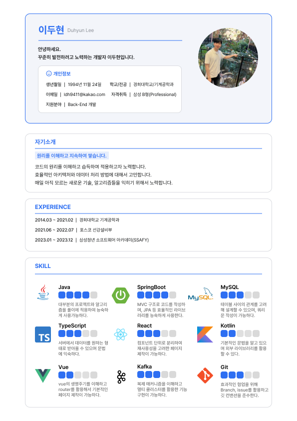
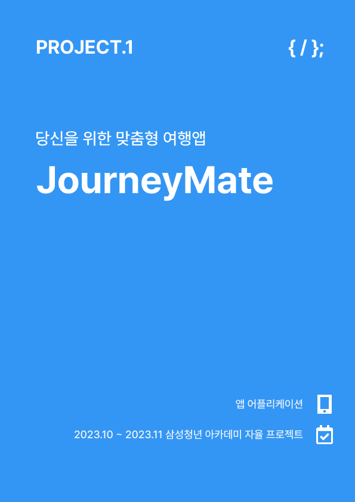
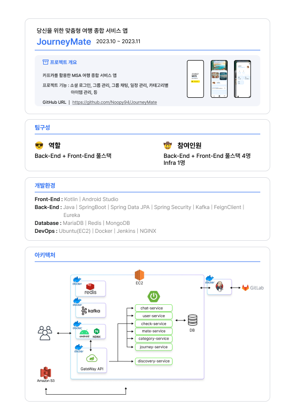
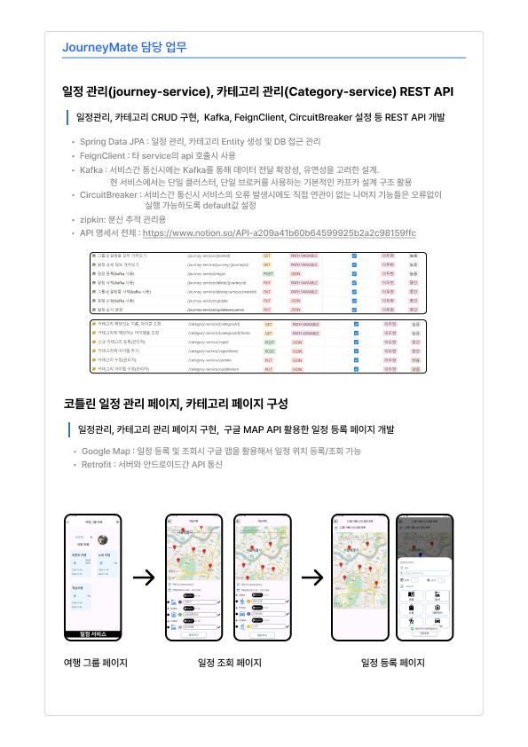
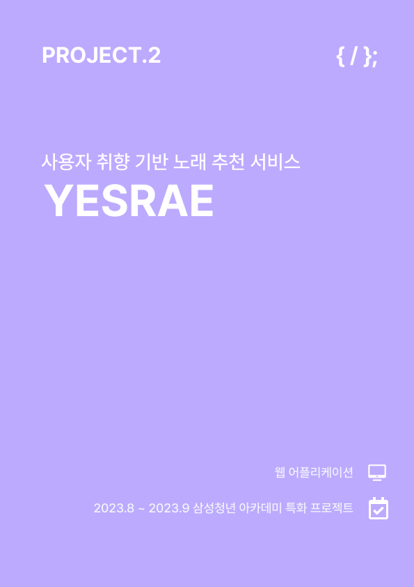
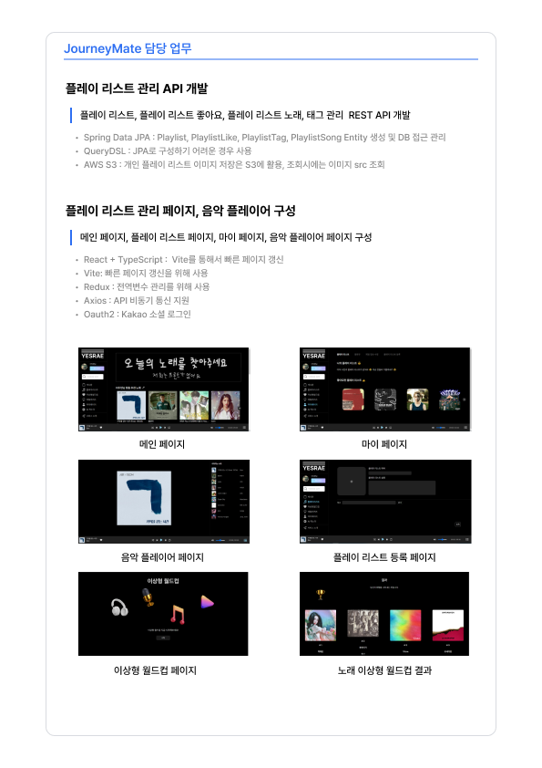

# LEE DU HYUN 😉

# BAEKJOON(온라인 저지 사이트)

# 자기소개

#### 안녕하세요! 
#### 제 이름은 이두현이고 백엔드를 중점적으로 공부하고 있습니다.   
#### 기계공학과를 전공하고 직장에서 일하다가 IT분야에 대해 너무 매력을 느껴서    
#### 기존의 커리어를 바꿔서 새로운 분야에 도전하고 있어요.   
#### 계속 발전하는 모습 보여주는 개발자가 되겠습니다.   

#### 최근에는 네트워크, 데이터 베이스, 운영체제와 같은 기본 지식들을 위주로 공부하고 있습니다.
#### 2024.02.15일 기준 DB 쿼리 최적화를 공부하고 있습니다.

# Experience

#### 2023. 01 ~ SSAFY(삼성 청년 소프트웨어 아카데미) 9기 완료
#### 2023. 10 삼성 소프트웨어 등급 B형 획득!!

# Skills
## Languages

## Tools

## Backend Libraries & Frameworks

## Frontend Libraries & Frameworks

 
## :mailbox_with_mail: Contacts
   

------------------------------------------------------------------------------------------  

## 포트폴리오

  
  
  
  
  
  
  

