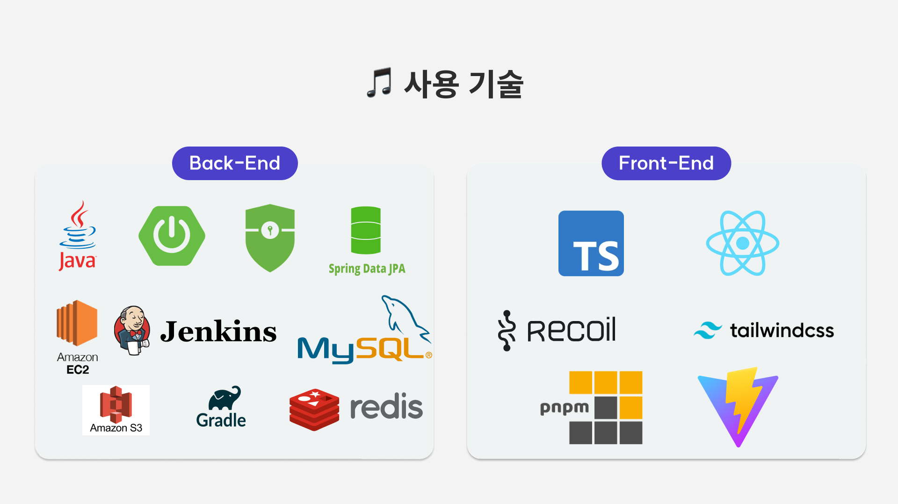
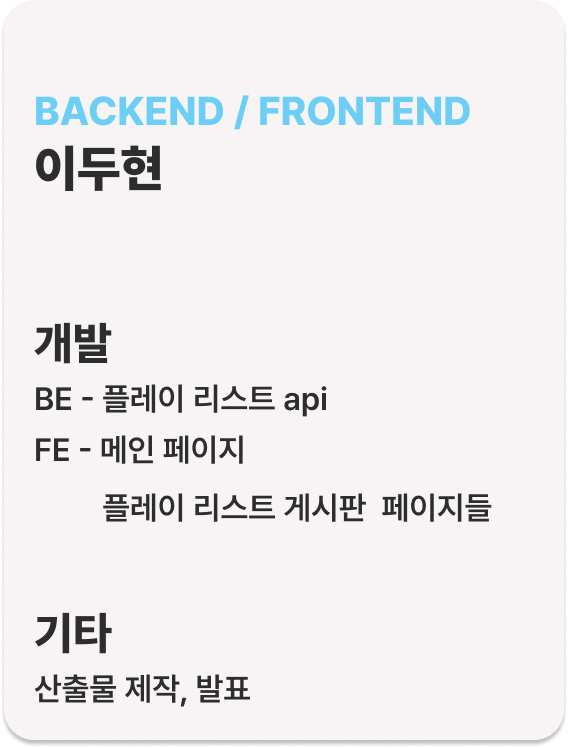
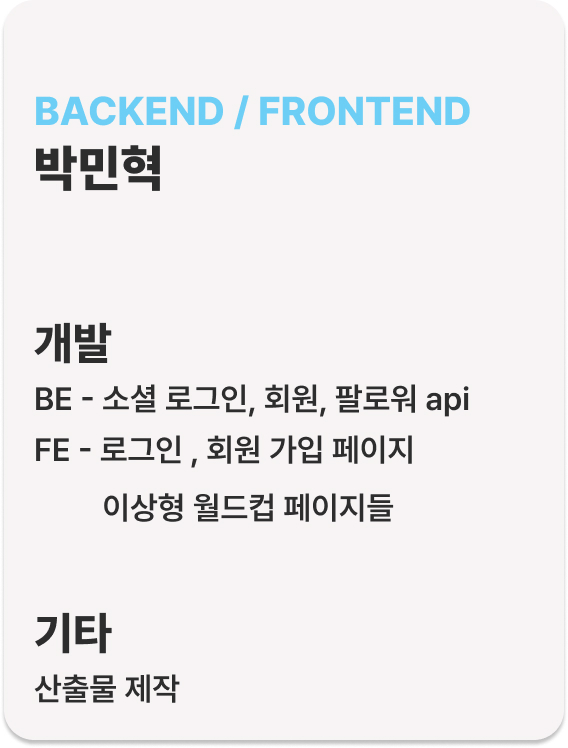
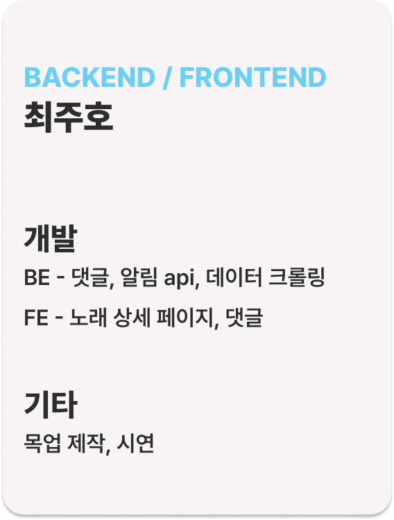
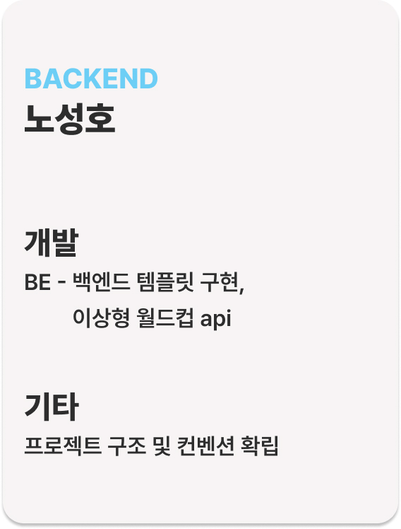
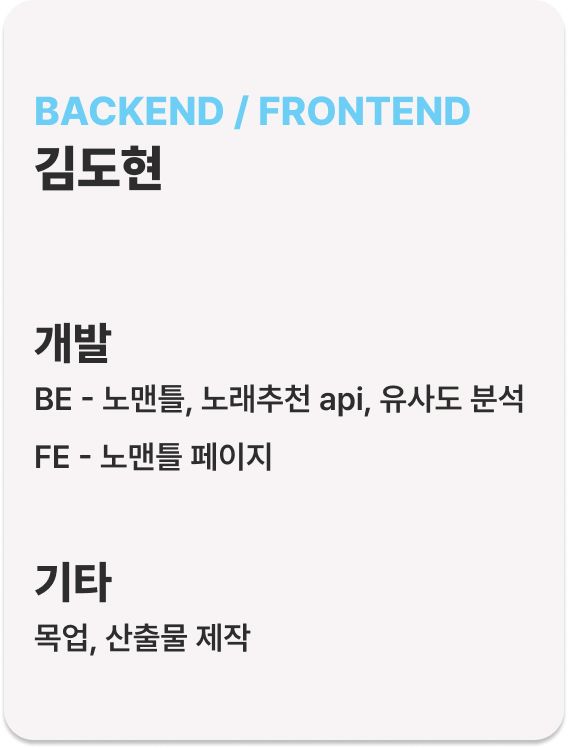
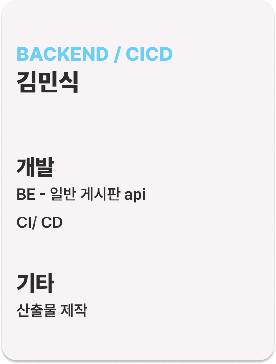
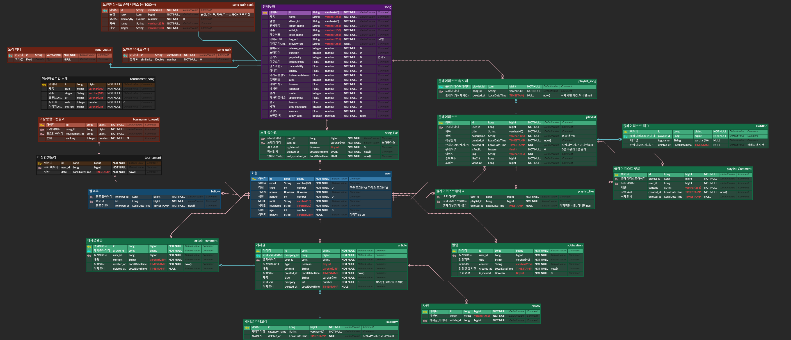

# LEE DU HYUN 😉

# BAEKJOON(온라인 저지 사이트)

# 자기소개

#### 안녕하세요! 
#### 제 이름은 이두현이고 백엔드를 공부하고 있습니다.   
#### 기계공학과를 전공하고 직장에서 일하다가 IT분야에 대해 너무 매력을 느껴서    
#### 기존의 커리어를 바꿔서 새로운 분야에 도전하고 있어요.   
#### 계속 발전하는 모습 보여주는 개발자가 되겠습니다.   

#### 2023.10.10일 기준 Springcloud를 활용한 msa 설계에 관심을 가지고 공부를 진행중입니다.

# Experience

#### 2023. 01 ~ SSAFY(삼성 청년 소프트웨어 아카데미) 9기 진행중

# Skills
## Languages

## Tools

## Backend Libraries & Frameworks

## Frontend Libraries & Frameworks

 
## :mailbox_with_mail: Contacts
   

------------------------------------------------------------------------------------------  

## 진행한 프로젝트(현재까지는 SSAFY 프로젝트만 기재되어 있습니다.)  

## 🎵 YESRAE 노래 추천 프로젝트 (빅데이터 추천)

## 프로젝트 소개

- 프로젝트명: **YESRAE**
- 서비스 특징: 사용자 취향 기반 노래 추천 서비스
- 주요 기능
  - 노래 플레이리스트
  - 유사도 기반 노래 퀴즈 (노맨틀)
  - 노래 이상형 월드컵
  - 이상형 월드컵 결과 바탕의 노래 추천
- 주요 기술
  - Annoy를 이용한 ANN 알고리즘 (노래 추천)
  - OAuth2.0, JWT
  - REST API
- 참조 리소스
  - JPA: 객체와 데이터베이스의 관계를 매핑
  - Querydsl: 쿼리 작성
  - Tailwind CSS: 디자인 전반 적용
  - Material Tailwind: 디자인 전반 적용
- 배포 환경
  <!-- 웹 서비스, 랜딩 페이지, 프로젝트 소개 등의 배포 URL 기입 -->
  - URL: [https://j9a304.p.ssafy.io/](https://j9a304.p.ssafy.io/)

## 프로젝트 상세 설명

### 개발 환경

### Frontend

- React (18)
  - Recoil
- TypeScript (5.2.2)
- Tailwind CSS
- Axios
- pnpm
- Vite
- Node.js (18.17.1)

### Backend

- Java (17)
- Spring Boot (3.1.3)
- Gradle (3.1.3)
- dependencies
  - Spring Security
  - JPA
  - querydsl
  - aws s3
- MySQL (8.0.33)
- Redis (3.0.504)
- Fast API (0.103.1)

### Server

- AWS EC2

## Skills

---

## 소프트웨어 아키텍처

## 팀 소개

<table>
  <tr>
    <td align="center" width="500px">
      
    </td>
    <td align="center" width="500px">
      
    </td>
    <td align="center" width="500px">
      
    </td>
  </tr>
  <tr>
    <td align="center">
      <a href="https://github.com/Noopy94" target="_blank">
        이두현 (Back-end / Front-end)
      </a>
    </td>
    <td align="center">
      <a href="https://github.com/jvlover" target="_blank">
        박민혁 (Back-end / Front-end)
      </a>
    </td>
    <td align="center">
      <a href="https://github.com/mongsuokki" target="_blank">
        최주호 (Back-end / Front-end)
      </a>
    </td>
  </tr>
  <tr>
    <td align="center" width="500px">
      
    </td>
    <td align="center" width="500px">
      
    </td>
    <td align="center" width="500px">
      
    </td>
  </tr>
  <tr>
    <td align="center">
      <a href="https://github.com/bamtolee" target="_blank">
        노성호 (Back-end)
      </a>
    </td>
    <td align="center">
      <a href="https://github.com/fnejd" target="_blank">
        김도현 (Back-end / Front-end)
      </a>
    </td>
    <td align="center">
      <a href="https://github.com/DUDINGDDI">
        김민식 (Back-end / Infra)
      </a>
    </td>
  </tr>
</table>

---

### ERD

## 화면

### 메인화면 (플레이 리스트)

- 플레이 리스트 목록을 바로 확인 가능합니다.

### 마이페이지

- 마이페이지에서 회원이 좋아요한 플레이 리스트, 등록한 플레이 리스트 확인이 가능합니다.

### 음악 플레이어

- 플레이 리스트 수록된 재생

### 플레이 리스트 등록

- 플레이 리스트 이미지, 제목, 설명, 태그 와 플레이 리스트 노래를 등록할 수 있습니다.

### 로그인 페이지

- 카카오 로그인과 구글 로그인이 가능 합니다.

### 노래 상세 페이지

- spotify 에서 제공하는 노래 특성 정보들을 확인할 수 있습니다.

### 노래 퀴즈 페이지

- 노래 제목을 입력하면 저장되어 있는 곡들 중 해당 제목과 일치하는 가장 유사도가 높은 곡의 정답곡과의 유사도와 유사도 순위 결과가 나타납니다.

### 이상형 월드컵

- 이상형 월드컵 시작 화면입니다. 몇강을 할 것인지 선택이 가능합니다.  

- 이상형 월드컵 진행 화면입니다.

- 이상형 월드컵 결과 화면에서는 1위에서 4위까지의 결과가 나타납니다.

### 노래 추천

- 이상형 월드컵의 1위에서 4위곡들을 바탕으로 총 8곡을 추천합니다.

## ✈️ JourneyMate (Springcloud를 활용한 msa 프로젝트)

- api-gateway를 활용해 서비스 접근 
- service별 통신에는 feignclient사용
- 각 서버가 독립적으로 진행함을 진행
- 다중 서비스 분산처리를 위해 DB 접근에는 kafka를 사용
- 서비스 장애 이후 DB 데이터 동기화시에도 kafka사용
- circuitbreaker를 사용해 장애 대비
- ~11/17까지 진행중

